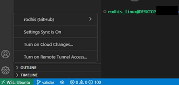
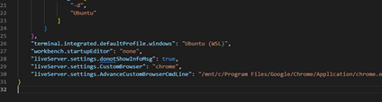

# Instalação de Windows subsystem for Linux (WSL) 2 (v.1.0)

O WSL é uma ferramenta que permite uma distro Linux rodar como um subsistema dentro do seu Windows, lhe dando acesso ao seu terminal e todas as suas funcionalidades, como git, npm, yarn, node.js e por aí vai, sem precisar instalar arquivos adicionais em seu Windows.

O WSL2 é compatível com Windows 10 ou 11. É importante seguir os passos conforme escrevo aqui, pois existem diversas pequenas dificuldades que precisam ser evitadas ou vencidas para que tudo funcione corretamente.

## Passo a passo:

1. Instale o WSL2 com a distro de escolha. Vou usar Ubuntu (sem versão) (NOTA: corresponde à versão 22.04.1, com última atualização em 14/03/2022, sendo a mais atualizada na última edição deste documento). Para tanto, siga os passos do vídeo abaixo, que mostra a instalação completa, bem como o uso de diversos comandos que você precisará depois. É IMPORTANTE VERIFICAR ATUALIZAÇÕES TAMBÉM, como mostrado no vídeo!
   https://www.youtube.com/watch?v=o1_E4PBl30s

2. Ao abrir o terminal do Linux ele te pedirá um novo nome de usuário. Este precisa ser algo como “seunome_linux” ou “nome_ubuntu” (sem as aspas) . É necessário colocar “linux” ou o nome da distro no seu usuário por ser um padrão do WSL (nota: não testei todas as combinações para saber EXATAMENTE o que é necessário, mas sei que, com nome e distro, é o suficiente). Logo após ele pedirá uma senha, que será utilizada para quase tudo do Linux. Sugiro escolher algo fácil.

3. Verifique se existem atualizações da sua distro. No Ubuntu, use os comandos:  
<pre>•   sudo apt update  
•   sudo apt -y upgrade  </pre>

4. Instale o VSCode em seu **Windows**, com o instalador normal do site da Microsoft: https://code.visualstudio.com/download . **Não o abra após a instalação!**

5. Instale o Git em seu Linux, caso este já não venha instalado por padrão. Use o comando no terminal:

<pre>•	sudo apt install git-all</pre>

6. Faça toda a configuração de integração do seu Git com GitHub através do terminal. Ao fim, dê um git clone em algum repositório seu.

7. **Importante!** Vá no repositório clonado ainda no terminal do Linux e abra-o com o comando “code .” (sem as aspas). Isso fará o terminal baixar as dependências necessárias para concluir a integração do seu Git do WSL e VSCode do Windows.

8. No VSCode, abra um novo terminal, clique no + e vá em “select default profile”. Selecione wsl (que pode estar já como bash, se já fez todo o necessário para a configuração).
9. Tudo estará ok se o seu perfil do GitHub estiver em Sync com seu VSCode e seu terminal abaixo estiver verde com “WSL:nomedadistro”, conforme imagem:

 

## Cuidados importantes:

a) Evite usar comandos do Windows (Ctrl + c, Shift + del, clique direito etc.) para mexer nas pastas que contém os diretórios do WSL. Isso costuma dar erros de permissão. Use o terminal do Linux.

b) Clone seus repositórios do GitHub ao invés de copiar e colar de um backup em disco ou nuvem. Isso evita erros de permissão com o Git também.

c) Sempre abra uma nova instância do VSCode ou uma pasta numa janela nova de WSL. Para fazer isso você pode dar “open folder” ou clicar no botão verde da imagem e ir em “new wsl Window”, onde pode, então, abrir sua repo com o VSCode integrado. **Abrir diretamente pelo Windows não integra o Git WSL e gera diversos erros de permissão e untrusted files**, então evite fazer assim!

d) Não é necessário instalar Git no Windows com esse método!

## Eliminando arquivos Zone.identifier

Ao usar WSL muitos desses arquivos podem aparecer quando você baixa ou cola arquivos na sua pasta Linux. Eles servem para identificar a fonte de origem de cada arquivo copiado, mas, fora isto, apenas bagunçam tudo. Para resolver este problema:

a) Use o atalho do Windows “Win + R” e digite na caixa de executar <pre>gpedit.msc</pre>

b) Siga o caminho: Configuração de Usuário -> Modelos administrativos -> Componentes do Windows -> Gerenciador de Anexos.

c) Clique duas vezes em “<u>Não preservar informações de zona em anexos de arquivos</u>”;

d) Marque a opção **“habilitado”**.

(OBS: Para acessar o editor de políticas de grupo é necessário possuir Windows 10 Pro ou superior.)

e) Para limpar arquivos Zone.identifier já existentes abra um terminal no Linux e use o comando:

<pre>• find “pasta alvo” -type f -name "\*:Zone.Identifier" -exec rm -f {} \;</pre>

Substitua "pasta alvo" pelo caminho onde estão seus arquivos.

## Configuração necessária do Live Server:

Para utilizar a extensão Live Server, podem ser necessárias configurações adicionais para que esta funcione. Siga os passos:

a) Vá em Extension Settings do Live Server. Logo no início estará a opção “<u>Advance Custom Browser Cmd Line</u>”. Clique em "<u>Edit in settings.json</u>"".

b) Na nova janela que se abrir, adicione ou edite as linhas antes do último fechamento com chave } :

### Chrome
<pre>"liveServer.settings.CustomBrowser": "chrome",

"liveServer.settings.AdvanceCustomBrowserCmdLine": "/mnt/c/Program Files/Google/Chrome/Application/chrome.exe"</pre>

Vai ficar algo assim:  

 

### Edge:

<pre>  "liveServer.settings.CustomBrowser": "microsoft-edge",
    "liveServer.settings.AdvanceCustomBrowserCmdLine": "/mnt/c/Program Files (x86)/Microsoft/Edge/Application/msedge.exe"</pre>
   
Para outros navegadores, é necessário editar o CustomBrowser e indicar o caminho específico de seu executável na AdvanceCustomBrowser(...).

## Gerenciador de pacotes, SASS, Vue, Node.js e outros:

Estes recursos de programação são instalados via gerenciadores de pacotes, como npm ou yarn. Aqui, usaremos npm. Para instalá-lo, utilize no terminal:

<pre>• curl -o- https://raw.githubusercontent.com/nvm-sh/nvm/v0.35.3/install.sh | bash</pre>

- Para instalar SASS:

  <pre>• npm install -g sass</pre>

- Para o Vue:

  <pre>• npm install vue@next
  • sudo npm install -g @vue/cli-</pre>

  Ver documentação em:

  https://vuejs.org/guide/quick-start.html

  Para node.js, utilizar este tutorial:

  https://learn.microsoft.com/en-us/windows/dev-environment/javascript/nodejs-on-wsl

  NOTA: Se acontecerem erros de console na instalação de alguns desses, use **sudo** antes dos comandos para remover as necessidades de permissão de acesso.

## MySQL Server e Workbench

Alguns comandos do Linux não ficam disponíveis no WSL. Siga os passos para utilizar de acordo:    

### <u>MySQL Server</u>    

1- Instale o Server em seu terminal WSL com o comando:
  <pre>sudo apt-get install mysql-server </pre>

E confirme a instalação com <pre>mysql --version </pre>

2- Inicie o servidor MySQL com o comando:

  <pre>sudo /etc/init.d/mysql start</pre>
  (stop encerra o servidor)   

3- Faça as configurações de segurança. Use o comando:

<pre> sudo mysql_secure_installation </pre>

Alguns pedidos de resposta surgirão. Sâo eles:

- Usar o componente de validação de senhas? Digite <b>n</b>
- Senha do root: Digite sua senha para acesso root (padrão), aqui, aperte enter e repita a senha, apertando enter novamente.
- Remover usuários anônimos: digite <b>y</b>
- Não permitir login remoto: digite <b>n</b>
- Remover db de teste: digite <b>n</b>
- Recarregar privilégios: digite <b>y</b>

4- Para abrir o editor MySQL no terminal, digite:
<pre>sudo mysql -p </pre>
Digite a senha do usuário root, e tecle enter. Requer que o servidor esteja rodando <b>(passo 2)</b>.

5- Para confirmar que tudo está ok, coloque o comando no editor MySQL:

<pre> SHOW DATABASES; </pre>

Se 4 tabelas aparecerem, a instalação foi bem sucedida.    

### <u>Permitir acesso remoto e simplificado </u>  

-No editor MySQL, rode:

<pre>ALTER USER 'root'@'localhost' IDENTIFIED WITH mysql_native_password BY 'root';</pre>
No lugar de 'root', coloque a senha setada no passo 3.    

### <u>Iniciar servidor MySQL com o WSL </u>   

No terminal WSL, use o comando:

<pre>sudo update-rc.d mysql defaults</pre>

Isso iniciará o servidor sempre que o WSL estiver aberto, evitando de ter sempre que colocar o comando do item 2 (sessão de instalação).   

### <u> MySQL Workbench </u>    

1- Faça o download do aplicativo para <b>Windows</b> e proceda com sua instalação normal.

2- Abra o aplicativo, siga o caminho 'Database - Manage connections'.

3- Clique em 'New'.

4- Em 'Connection Name', dê seu nome de escolha para a conexão.

5- Na aba 'Parameters', certifique-se de que o username está root. Clique em 'Store in Vault' e coloque o password que você setou na configuração do Server no terminal.

6- Na aba 'system profile', certifique-se de que o System Type esteja como "FreeBSD".

7- Tenha certeza de que o servidor MySQL está rodando  no WSL (ver sessão de instalação) e clique em "Test connection". Se estiver ok, pode clicar em close.

8- Sua conexão deve aparecer na tela inicial do Workbench, e você só precisará clicá-la para acessar (lembre-se, o servidor precisa estar rodando no WSL).

### 

  ## Extras:

  a) Use o Windows Terminal como indicado no vídeo. Clique na setinha ao lado do indicador de janela do terminal que está aberto, vá em configurações. Em <u>Inicialização</u>, você pode colocar para abrir diretamente o terminal WSL. Em <u>Padrões</u>, pode colocar para sempre abrir como administrador, o que economiza tempo.

  b) Se quiser remover a maioria das requisições de senha do Linux, use o comando:

  <pre>• sudo visudo</pre>

  No arquivo que abrir, procure as linhas com **%admin** e **%sudo**, e troque o final das linhas:

  ALL  
  por 
  NOPASSWD: ALL  

  Aperte Ctrl x, aperte y e dê um enter para salvar as configurações novas.
